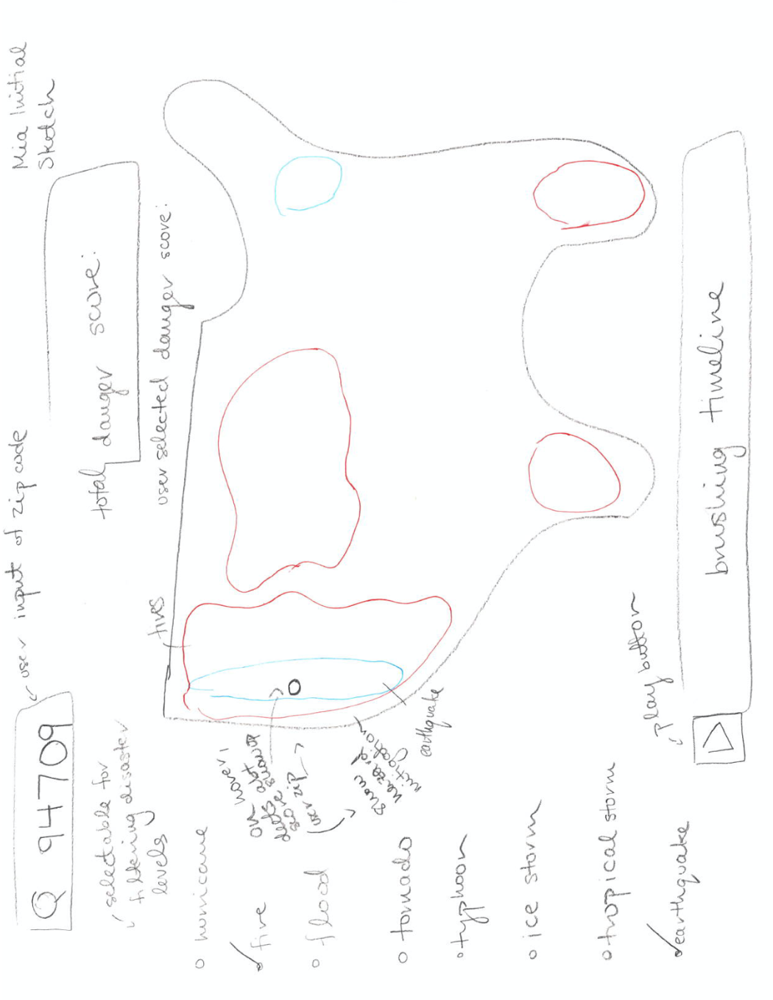

# So You Wanna Live Here?

This project is a natural disaster visualization created in collaboration with two other students.

To run this project, clone the repository onto your local setup and open index.html on your local server. 

---

## Project Details & Design Thinking Stages

This map serves as a tool for people planning a move, helping them assess how prone their prospective locations are to natural disasters.

---

### 1. Empathize: Understanding the Problem & Setting Goals

Climate change data is often purely informational rather than actionable, which can lead to fear-mongering. Our goal was to present this data in a way that encourages informed decision-making.  

By visualizing the increasing frequency of natural disasters across the country, we hope to provide insights that empower people to make decisions while offering an engaging and educational resource for those curious about disaster history. 

We want to acknowledge systemic disparities in infrastructure, often tied to housing and environmental injustice, which leave marginalized communities disproportionately affected by natural disasters. These impacts include weaker infrastructure, limited recovery resources, and placement in areas more vulnerable to environmental hazards.  

---

### 2. Define: Sourcing & Preparing Data

We used data from FEMA's [Disaster Declarations Summaries](https://www.fema.gov/openfema-data-page/disaster-declarations-summaries-v2), which includes disaster records from 1953 to 2021 (around 60,000 entries).  
During data cleanup, unnecessary data points like the "biological" disaster type (focused on epidemics) were omitted, as they fall outside this project's scope.

---

### 3. Ideate: Sketching the Concept

We created three initial design sketches:

| Sketch 1                | Sketch 2                | Sketch 3                |
|-------------------------|-------------------------|-------------------------|
|  |  |  |

The final design draft was created using Adobe XD:  

---

### 4. Prototype: Building the Visualization

The prototype was built in JavaScript using the D3.js library. The state outline geometries were sourced from Leaflet.

**Prototype 1:**  

**Final Version:**  

---

### 5. Test: Interactive Features  

Our final visualization includes several interactive elements:  

1. **County Selection**  
   - Search by ZIP code or click on any county to populate the pop-up bar.  

2. **Pop-Up Bar Features**  
   - Hover over the risk score to see how it was calculated.  
   - Click on sections of the donut chart for detailed data, such as specific disaster names and dates.  
   - Example of the modal:  
       

3. **County Comparison**  
   - Click "Compare County" to view another county's data side-by-side, with the same interactive features available.  

4. **Year Brushing**  
   - Adjust the year range to display the most common disasters for each county within the selected time frame.
   - Example:  
       

5. **Interactive Legend**  
   - Click on a disaster type in the legend to display only that specific disaster spread. 
   - Example legend items:  

     
     
     
     
     
     

---

## Notes

- **Alaska-Specific Issues:**  
  Alaska's data posed a challenge because it is divided into boroughs instead of counties, and many disasters are linked to specific reservations or regions. While ZIP code searches for Alaskan disasters work, clicking on regions may show zero disasters due to incompatibilities in the datasets.  

- **Code & Data Sources:**  
  All project files contain original code (no GenAI was used), except for explicitly cited lines from third-party sources.  

**External Files:**  
1. `DisasterDeclarationsSummaries.json`: FEMA natural disaster data.  
2. `geojson-counties-fips.json`: County geometries (source: Plotly Datasets).  
3. `StatesData.js`: State outline geometries (source: Leaflet.js).  
